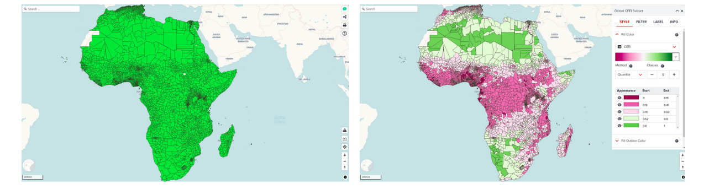
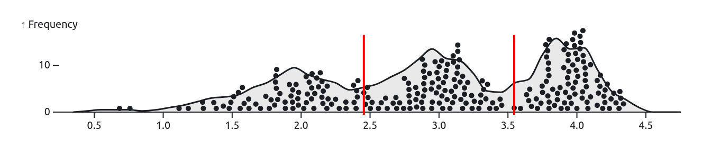
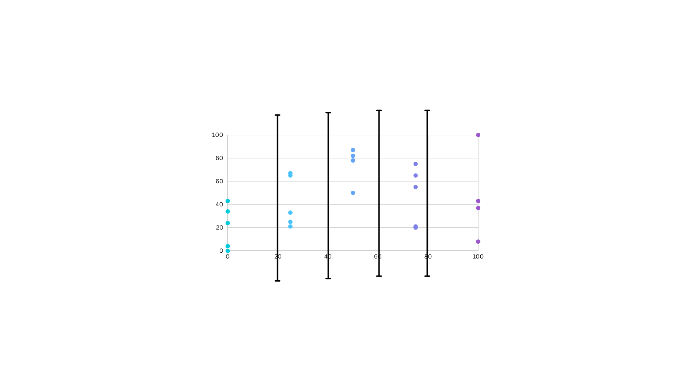
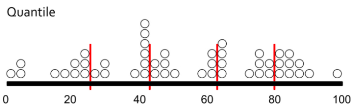
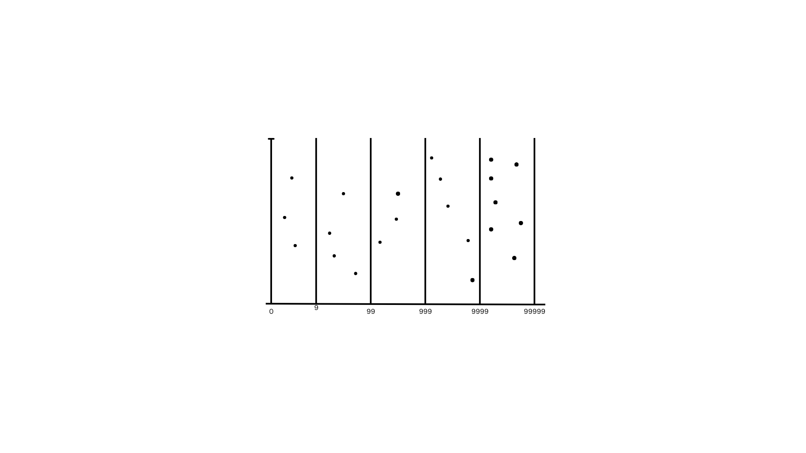

# Classification methods for visualization

--

#### Classification methods...
- Enable insights into patterns and relationships within the data.
- Are essential in creating meaningful representation on maps.

<hidden>

It is important to choose an appropriate classification method if the default layer visualization does not look good.
Poor visualization might occur particularly for highly skewed dataset. Classification method option can be useful for better visualization.

</hidden>

---

## Types of classification methods

---

### Natural breaks classification

- Classes are based on natural groupings inherent in the data.
- Boundaries are set where there are significant differences in the data values

<hidden>

Class breaks are created in a way that best groups similar values together and maximizes the differences between classes. 

The features are divided into classes whose boundaries are set where there are relatively big differences in the data values.

</hidden>

---

### Equal Intervals classification

- Divides the range of attribute values into equal-sized subranges.

<hidden>

This allows you to specify the number of intervals, and the class breaks based on the value range are automatically determined.

For example, if you specify three classes for a field whose values range from 0 to 300, three classes with ranges of 0–100, 101–200, and 201–300 are created.

</hidden>

---

### Quantile

- Each class contains an equal number of features.
- Same number of data points to each class

<hidden>

A quantile classification is well suited to linearly distributed data. Quantile assigns the same number of data values to each class. There are no empty classes or classes with too few or too many values

</hidden>

---

### Logarithmic

Logarithmic transformation of the data has been recommended by the literature in the case of highly skewed distributions such as those commonly found in information science. 

<hidden>

The purpose of the transformation is to make the data conform to the lognormal law of error for inferential purposes.

</hidden>

---

## Next step

We have gone through both vector and raster visualization in detail. We are going to do an exercise to visualize datasets at the next section.