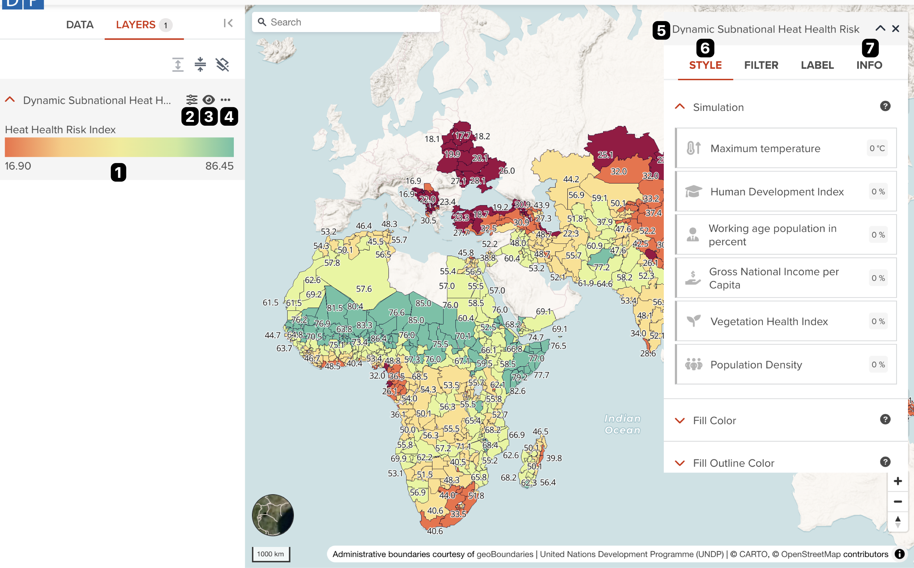
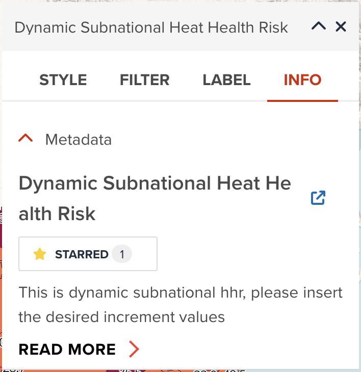
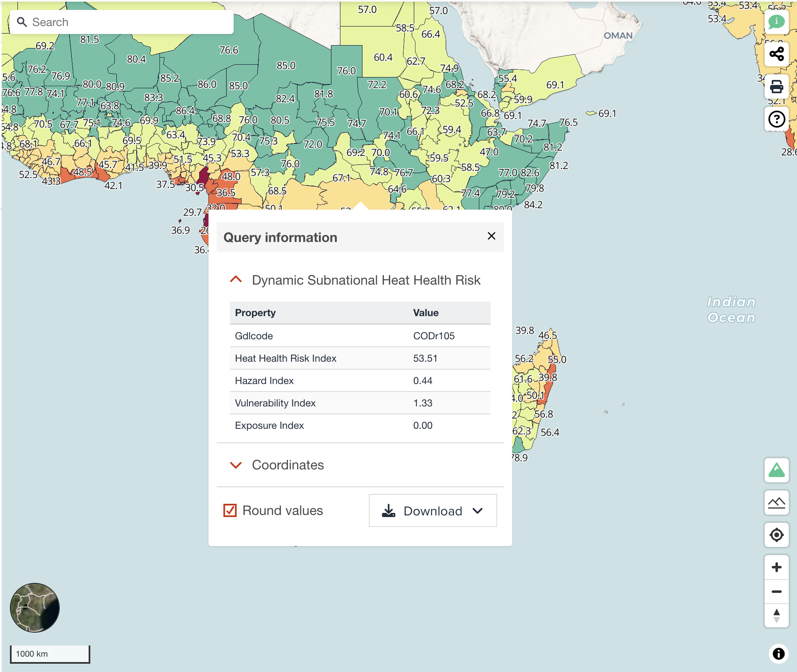

# Overview of visualization components

From this section, we are going to explore how to visualize a dataset on GeoHub. In this page, you will learn key components used for both raster and vector data layer.

---

## Key components on visualizing a layer

Once you have added a dataset or open an existing user map, you should be able to see a map like the below figure.

--

<!-- .element style="height: 400px" -->

A map page consists of two main components:

- [Legend](#legend): corresponding to No. 1 on the figure
- [Editing panel](#editing-panel): corresponting to No.5 on the figure

---

### Legend

Each accordion for a data layer, it has normally three buttons and legend as follows:

--

1. Legend: A legend is shown in this place. It consists of color or icon legend, unit name or property name and minimum/maximum value depending on the type of the dataset.
2. Editing button: Editing panel will be shown in the right side of window if you click it.
3. Visibity button: You can make a layer visible or invisible by toggling eye icon button.
4. Optional menu: Other optional menu is available from three dotted button. <hidden>If click **Zoom to layer**, it will zoom to the layer's maximum boundary automatically. **Show only this layer** is useful if you only want to focus the selected data layer without seeing others. If you feel this data layer is no longer needed in the map, click **Delete layer** menu to remove it from the map.</hidden>

---

### Editing panel

In the editing panel, it consists of several tabs such as **STYLE** tab, **FILTER** tab, **LABEL** tab, **TRANSFORM** tab and **INFO** tab. Some tabs may not be seen depending on the type of data layer (raster or vector).

--

The following two tabs are commonly available for all layer types. Here, we only explain these two tabs and the rest of features will be explained in the later section for raster and vector visualization.

---

#### **Style** tab

This tab (No.6) consists of accordions for each editable property of a data layer. Except **Opacity** property, What kind of property is available depends on the [maplibre layer type](https://maplibre.org/maplibre-style-spec/layers/) of data layer. Each property will be explored in the later section.

--

##### Opacity

The user can change the opacity of each layer to their liking by using the “Opacity” property of each layer **STYLE** tab. Users can overlay different layers with this functionality. As default, layer opacity is added as 90%.

---

#### **Info** tab

In **INFO** tab (No. 7), you can see the dataset's metadata information. The below figure is an example vector data layer's info tab.

{:style="width: 400px;"}

<!-- .element style="height: 300px" -->

--

It consists of one or two accordions. **Metadata** accordion shows dataset title, description, star button and the link to an individual dataset page. **Dataset Statistics** accordion is only available for raster data layer. It gives you some statistics as histogram diagram that may help you visualize. This histogram will be explained further in raster visualization section later.

---

### Map query tool

You learned in the previous section that there is a map query tool available from  button. The below figure is an example of querying information for a layer. To use this query feature, you simply click your interested place on the map, GeoHub will query information by the exact coordinate which you clicked. You will be able to see detailed information immediately.

--

{:style="width: 400px;"}

<!-- .element style="height: 400px" -->

This map query tool is obviously helpful for you to visualize and analyze a data layer. It consists of several accordions for each layer and Coordinate accordion. You can also download queried data as GeoJSON or CSV format.

---

## Next step

In this section, we explored some common features and components on visualizing a data layer. From next chapter, we are going to learn how to visualize a vector dataset in detail.
