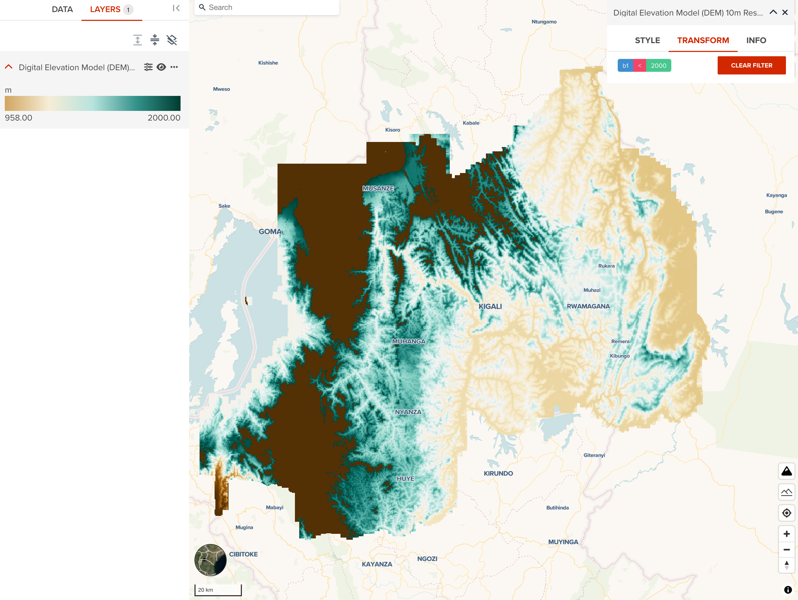

## The types of raster data layer

There are three types of raster layers as follows.

- A raster data that has a linear values (General raster in GeoHub)
- A raster data that has a unique values with label information (Call `Unique value raster` in GeoHub)
- A raster data that has true color image with 3 or 4 bands (RGB or RGBA).

<figure markdown="span">
  {:style="width: 400px;"}
  <figcaption>Three types of raster data in GeoHub. First layer is true color raster, second layer is unique value raster, and the last one is the most general raster which has linear values.</figcaption>
</figure>

## Style editing components

Except the Opacity property described in the previous section, the following visualization components for a raster data layer are available in Geohub. But some of components may not be available according to the raster layer type.

| Component                                        | General raster | Unique value raster | True color raster |
| ------------------------------------------------ | -------------- | ------------------- | ----------------- |
| [Color](#color)                                  | Available      | Limited             | N/A               |
| [Rescale Min/Max Values](#rescale-minmax-values) | Available      | N/A                 | N/A               |
| [Resampling](#resampling)                        | Available      | Available           | Available         |
| [Brightness Max](#brightness-max)                | Available      | Available           | Available         |
| [Brightness Min](#brightness-min)                | Available      | Available           | Available         |
| [Contrast](#contrast)                            | Available      | Available           | Available         |
| [Hue Rotate](#hue-rotate)                        | Available      | Available           | Available         |
| [Saturation](#saturation)                        | Available      | Available           | Available         |

### Color

#### General raster layer

Most raster datasets in GeoHub has this **Color** property to able to switch between **Simple linear legend** and **Categorized legend** from dropdown menu.

- Simple linear legend

As default, this simple legend is selected. You only can change colormap for this legend. Minimum and maximum values from raster statistics are also shown in the legend. If `Unit` tag is available in the dataset, you maybe can see unit name together.

<figure markdown="span">
  {:style="width: 300px;"}
  <figcaption>Simple raster color legend</figcaption>
</figure>

- Categorized legend

When you select **Categories** from dropdown, this categorized legend is generated automatically. This legend can provide you more advanced visualization. Like color classification component for [vector](./visualize_vector.md#fill-color), the key elements for raster are almost the same. You can increase or descrease the number of steps, and change classification method in addition to changing a colormap.

<figure markdown="span">
  {:style="width: 300px;"}
  <figcaption>Categorized raster color legend</figcaption>
</figure>

#### Unique value raster layer

As mentioned ealier, some raster datasets are unique value raster. In this case, **Color** property is also available, but its functionality is limited. GeoHub automatically assign a colormap randomly from diverging category to create categorized legend unless you have default style predefinied. You can change a default colormap to another one to make it look better.

<figure markdown="span">
  {:style="width: 300px;"}
  <figcaption>Unique values raster color legend</figcaption>
</figure>

### Rescale Min/Max Values

When the default visualization does not look good, you may need to adjust minimum and maximum values to rescale to achieve the better visualization.

<figure markdown="span">
  {:style="width: 300px;"}
  <figcaption>Adjust Minimum and Max Values to rescale</figcaption>
</figure>

Please have a look at [histogram](#how-histogram-can-be-used-for-visualization) section, it describes how you can use statistics in histogram to adjust rescale values.

### Resampling

The resampling/interpolation method to use for overscaling, also known as texture magnification filter.

- `Bi-linear`: (Bi)linear filtering interpolates pixel values using the weighted average of the four closest original source pixels creating a smooth but blurry look when overscaled

- `Nearest neighbor` (default): Nearest neighbor filtering interpolates pixel values using the nearest original source pixel creating a sharp but pixelated look when overscaled

### Brightness Max

Yoou can increase or reduce the brightness of the image between 0 and 1. The value is the maximum brightness, and default is 1.

### Brightness Min

You can increase or reduce the brightness of the image between 0 and 1. The value is the minimum brightness, and default is 0.

### Contrast

You can increase or reduce the contrast of the image between -1 and 1.

### Hue Rotate

You can adjust rotates hues around the color wheel between 0 and 359.

### Saturation

You can increase or reduce the saturation of the image between -1 and 1.

## How Histogram can be used for visualization

GeoHub offers the user to display their data set’s statistical information using a histogram which enables the user to determine skewness and kurtosis of the data set.

The first example displays the histogram for the Long-term Average Of Direct Normal Irradiation data set with a normal distribution and the second example is from the highly sked data set for the Population Density of 2020.

<figure markdown="span">
  
  <figcaption>Normal distribution example from Long-term Average Of Direct Normal Irradiation data in GeoHub</figcaption>
</figure>

<figure markdown="span">
  
  <figcaption>Highly skewed data example from Population Density of 2020 data in GeoHub</figcaption>
</figure>

As you can see, normal distribution data can be visualized quite well as default. However, visualization of highly skewed data is a little bit tricky although GeoHub is trying to optimize default setting. You may need to adjust rescale property for better visualization.

The below example is the Population Density of 2020 layer after adjusting rescale property. Now you can see the significant difference between before and after rescaling.

<figure markdown="span">
  
  <figcaption>Highly skewed data example after rescaled from Population Density of 2020 data in GeoHub</figcaption>
</figure>

It is worth to check how the data distribution looks like in case the default visualization does not look good.

## Transform tab (Advanced)

The **raster transform tab** provides an ability to filter the data in a different way of rescaling. Here, we use _Digital Elevation Model (DEM) 10m resolution, Rwanda_ dataset as an example to show each step how you can transform it.

- Click **Add** button under **TRANSFORM** tab

Open a layer editor panel, move to the **TRASFORM** tab, then click **ADD** button.

<figure markdown="span">
  
  <figcaption>Click Add button at TRANSFORM tab to start adding new filter rule</figcaption>
</figure>

- Select a math operator for filtering.

Firstly, you will be asked to select a mathmatics operator.

<figure markdown="span">
  
  <figcaption>Select an operator for filtering value</figcaption>
</figure>

the following operators are available for raster transform.

- `=`: Equals. Only show pixels which exactly matched threshold
- `≠`: Differs. Show pixels except exactly matched to threshold.
- `>`: Larger than. Show pixels which have greather than threshold value.
- `<`: Smaller than. Show pixels which have less than threshold value.
- `>=`: Larger than or equal to. Show pixels which have greater than or equal to threshold value.
- `<=`: Smaller than or equal to. Show pixels which have less than or equal to threshold value.

Here, we select `< (less than)` operator.

- Select a threahold and apply filter

Then, select a threshold and click **APPLY** button to apply new filtering rule for a raster dataset.

<figure markdown="span">
  
  <figcaption>Select a threshold which is applied for filtering together with the operator you selected in last step</figcaption>
</figure>

!!! note

    You can use a slider to roughly move it to the place which you disire to filter. Then, use `←` or `→` button in your keyboard to adjust the threshold precisely.

- The result after transforming

The following figure shows the result after applying the rule which the first band value is less than or equal to 1999m. If you compare the screenshot before applying a filter, you can clearly see what the difference is.

<figure markdown="span">
  
  <figcaption>After applying a filter rule in a raster data layer</figcaption>
</figure>

This raster transform can retain the original colormap and rescale settings after adding new transform rule. In this example, the pixels which have altitude is less than 2000 use the same color ramp with before. But pixels more than 1999m altitude shows dark brown color.

## Next step

We have explored how raster layer can be visualized in this section. We are going to learn how to save your styled map and share it with your colleagues at the next section.
