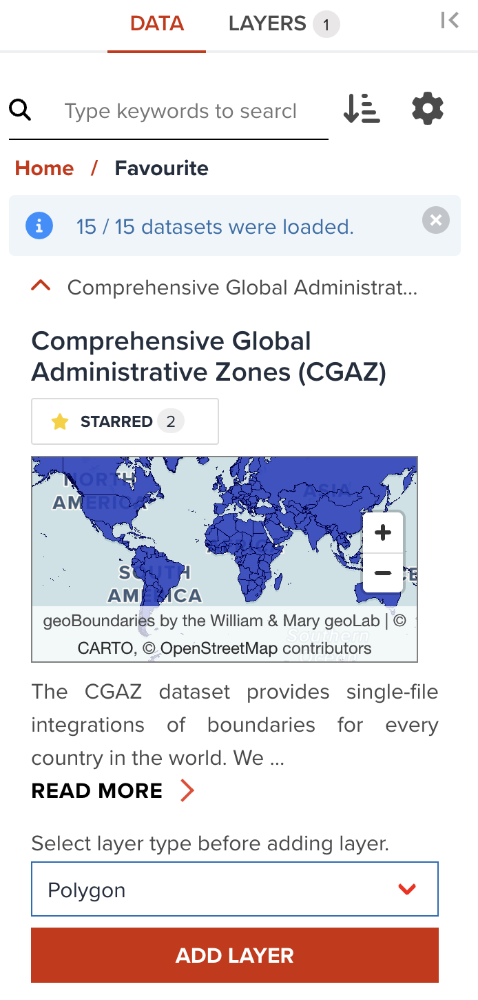

# Vector visualization overview

In addition to the common key components which we explored in the last section, we are going to explore how to visualize a vector data layer depending on the layer type in detail.

---

## The types of vector data layer

A vector data can be either **Polygon** or **Line** or **Point**. Polygon data can be added as a **Polygon** layer or **3D Polygon** layer or **Line** layer. Point data can be added as a **Point** layer or **Heatmap** layer or **Circle** layer. Line data only can be added as a **Line** layer.

--

Before adding a dataset to map, you can select a layer type as shown in the below figure. You can add a data by clicking add layer button inside an accordion.

{:style="width: 400px;"}

<!-- .element style="height: 500px" -->

---

<hidden>

## Style tab for each layer type

**Style** tab can provide you various properties to customize visualizing a data layer. <hidden>So far, the following layer types are available for vector data in GeoHub.</hidden>

- [Polygon](./visualize_vector_polygon.md): It is default layer type for Polygon data
- [3D Polygon](./visualize_vector_3dpolygon.md)
- [Line](./visualize_vector_line.md): It is default layer type for Line data
- [Point](./visualize_vector_point.md): It is default layer type for Point data
- [Heatmap](./visualize_vector_heatmap.md)
- [Circle](./visualize_vector_circle.md)

## Filter tab for filtering data

GeoHub offers a feature to filter vector data layer. The steps of filtering is described [here](./visualize_vector_filter.md).

## Label tab for adding information

Additional attribute information can also be added for a vector layer in GeoHub. The steps of adding labels is described [here](./visualize_vector_label.md).

</hidden>

## Next step

Let's start from polygon visualization at next section.
