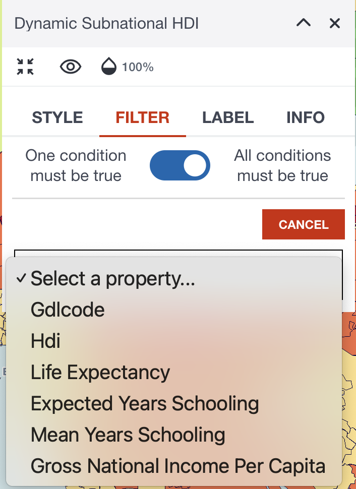
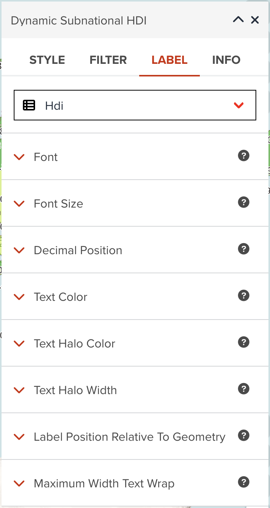

In addition to the common key components which we explored in the last section, we are going to explore how to visualize a vector data layer depending on the layer type in detail.

## The types of vector data layer

A vector data can be either **Polygon** or **Line** or **Point**. Polygon data can be added as a **Polygon** layer or **3D Polygon** layer or **Line** layer. Point data can be added as a **Point** layer or **Heatmap** layer or **Circle** layer. Line data only can be added as a **Line** layer.

Before adding a dataset to map, you can select a layer type as shown in the below figure.

<figure markdown="span">
  {:style="width: 400px;"}
  <figcaption>Selecting a vector layer type before adding to map at Data tab of Map editor page</figcaption>
</figure>

So far, the following layer types are available for vector data in GeoHub.

- [Polygon](#polygon): It is default layer type for Polygon data
- [3D Polygon](#3d-polygon)
- [Line](#line): It is default layer type for Line data
- [Point](#point): It is default layer type for Point data
- [Heatmap](#heatmap)
- [Circle](#circle)

## Style tab for each layer type

**Style** tab can provide you various properties to customize visualizing a data layer

### Polygon

<figure markdown="span">
  
  <figcaption>Styling for vector polygon layer</figcaption>
</figure>

A polygon layer can style the following two properties.

#### Fill color

You can choose two ways to set a color to polygons. As default, it uses a constant color which is randomly assigned. This might be useful if you just simply assign a single color to apply for polygon fill color.

<figure markdown="span">
  {:style="width: 300px;"}
  <figcaption>Constant color to visualize a layer</figcaption>
</figure>

- Categorized legend (Numeric property)

However, you might want to assign different color per value per property. In this case, you can also make categories to asign a color for each category class. Select a property from dropdown menu, it will automatically create categorized legend as shown in the below figure.

<figure markdown="span">
  {:style="width: 300px;"}
  <figcaption>Assign color for each categorized class by a selected property (Interval Legend)</figcaption>
</figure>

The figure shows an example when you select a numeric column. Numeric column can be classified by setting interval for each class. You can adjust categorized legend by the following parameters:

- **colormap**: You can select a colormap from the button. Colormap is available from three types - _Sequential_, _Diverging_ and _Qualitative_.
- **Method**: You can choose a classification method from _Equidistant_, _Quantile_, _Logarithmic_ and _Natural Breaks_. If the property values are highly skewed, _Logarithmic_ maybe can be selected for better visualization. _Equidistant_ is selected as default.
- **Classes**: As default, a legend will be created for five classes, however you can decrease or increase the number of classes between two and 25 classes.

Furthermore, you can assign different color per class manually by clicking color button in the table.

- Unique value legend (String property)

The below figure is also for a categorized legend when a string property is selected. This looks like much simpler than interval legend. You only can change a colormap applied for it. The categorized value table will be automatically created.

<figure markdown="span">
  {:style="width: 300px;"}
  <figcaption>Assign color for each categorized class by a selected property (Unique value Legend)</figcaption>
</figure>

#### Fill outline color

You can assign a color for polygon outline. As default, black color will be assigned.

### 3D Polygon

You can adjust the following four properties to visualize 3D polygons. This layer type can be suitable if you want to visualize a layer by using three dimensional.

<figure markdown="span">
  
  <figcaption>Styling for vector 3D polygon layer</figcaption>
</figure>

#### 3D Polygon color

You can assign a color or categorized colors for 3D polygon layer. This property can visualize the dataset horizontally. The color classification component is basically same with [Fill color](#fill-color) for Polygon layer.

#### Height of 3D Polygon

Visualizing the height of 3D polygons vertically. You can choose either a constant height value or values from selected property. You only can choose a property from numeric fields.

<figure markdown="span">
  {:style="width: 300px;"}
  <figcaption>Visualize polygons by height</figcaption>
</figure>

By combining two properties of **3D Polygon color** and **Height of 3D polygon**, you can visualize the data by using two indicators. This can be very powerful visualization for analysis.

#### Base Height

This is an optional property that you maybe need to ajust. It is the height with which to extrude the base of this layer.

#### Vertical Gradient to the sides

This is an optional property that you maybe can change it. it is whether to apply a vertical gradient to the sides of a 3D polygon layer. If true, sides will be shaded slightly darker farther down.

### Line

<figure markdown="span">
  
  <figcaption>Styling for vector line layer</figcaption>
</figure>

#### Line color

#### Line width

#### Line pattern

### Point

<figure markdown="span">
  
  <figcaption>Styling for vector point layer</figcaption>
</figure>

#### Icon

#### Icon color

#### Icon size

#### Overlap priority

### Heatmap

<figure markdown="span">
  
  <figcaption>Styling for vector heatmap layer</figcaption>
</figure>

#### Heatmap color

#### Heatmap intensity

#### Heatmap radius

#### Heatmap weight

### Circle

<figure markdown="span">
  
  <figcaption>Styling for vector circle layer</figcaption>
</figure>

#### Circle radius

#### Circle color

#### Circle stroke color

#### Circle stroke width

## Filter tab

<figure markdown="span">
  {:style="width: 300px;"}
  <figcaption>Adding new filter rule</figcaption>
</figure>

<figure markdown="span">
  {:style="width: 300px;"}
  <figcaption>Selecting a property to apply this rule of filtering</figcaption>
</figure>

<figure markdown="span">
  {:style="width: 300px;"}
  <figcaption>Select an operator that is used for this rule</figcaption>
</figure>

<figure markdown="span">
  {:style="width: 300px;"}
  <figcaption>Apply value for this rule to filter</figcaption>
</figure>

<figure markdown="span">
  {:style="width: 300px;"}
  <figcaption>Viewing and managing existing filtering rules</figcaption>
</figure>

## Label tab

<figure markdown="span">
  {:style="width: 300px;"}
  <figcaption>Selecting label option by choosing a property</figcaption>
</figure>

<figure markdown="span">
  {:style="width: 300px;"}
  <figcaption>Available properties for labels</figcaption>
</figure>

## Next step

In this section, you have learned how to visualize vector layer for each layer type in detail. You are going to explore how you can visualize a raster layer in the next section.
