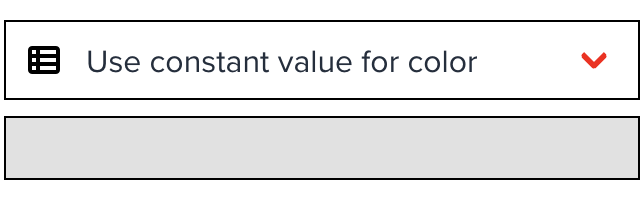
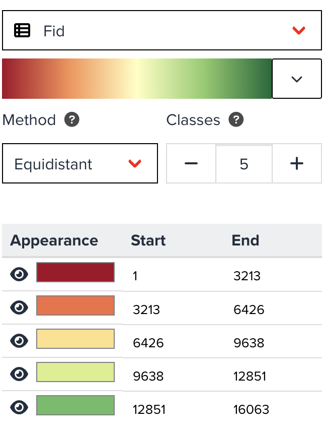
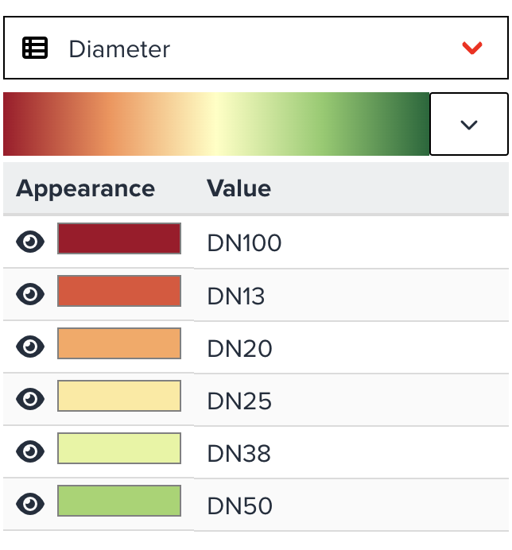
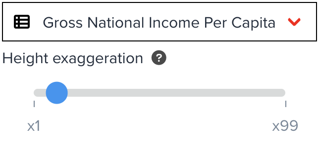
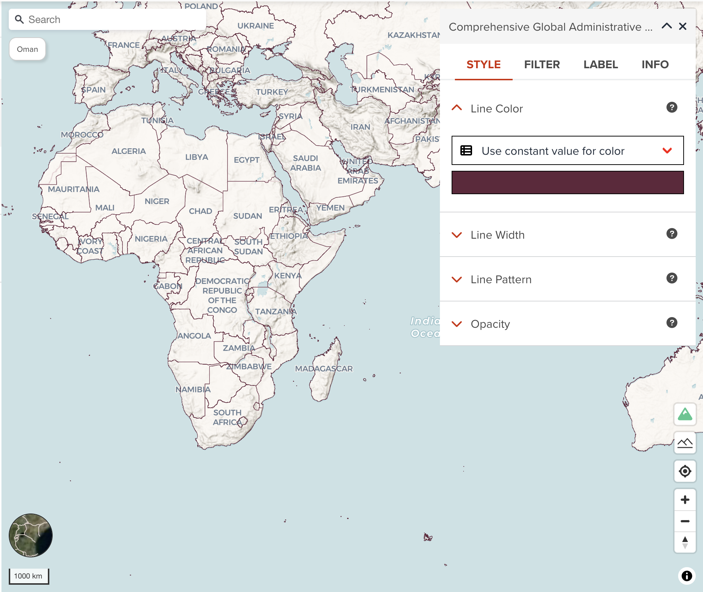
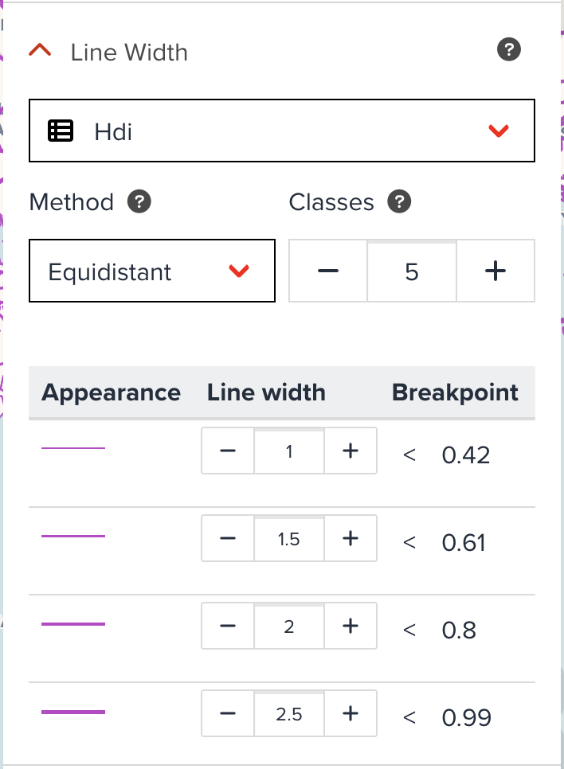
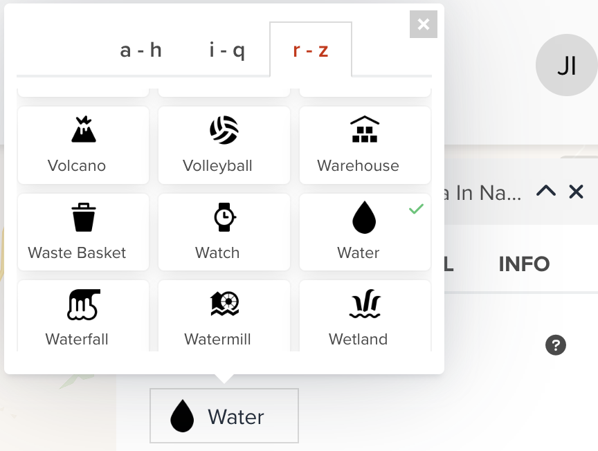
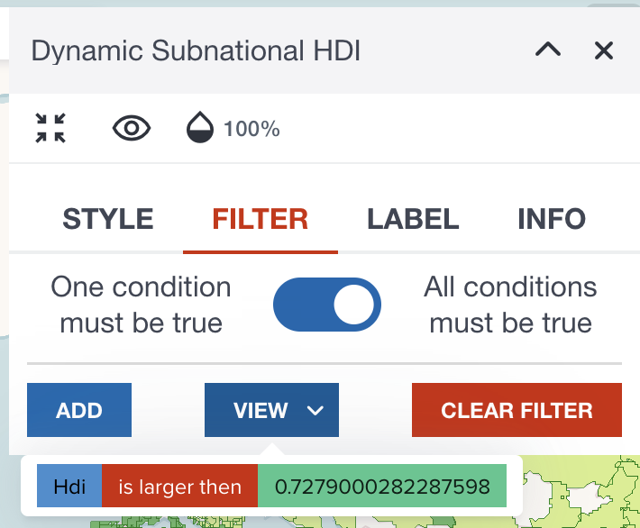
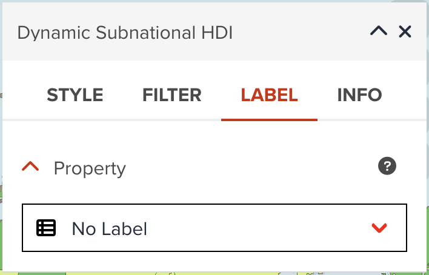

In addition to the common key components which we explored in the last section, we are going to explore how to visualize a vector data layer depending on the layer type in detail.

## The types of vector data layer

A vector data can be either **Polygon** or **Line** or **Point**. Polygon data can be added as a **Polygon** layer or **3D Polygon** layer or **Line** layer. Point data can be added as a **Point** layer or **Heatmap** layer or **Circle** layer. Line data only can be added as a **Line** layer.

Before adding a dataset to map, you can select a layer type as shown in the below figure.

<figure markdown="span">
  {:style="width: 400px;"}
  <figcaption>Selecting a vector layer type before adding to map at Data tab of Map editor page</figcaption>
</figure>

So far, the following layer types are available for vector data in GeoHub.

- [Polygon](#polygon): It is default layer type for Polygon data
- [3D Polygon](#3d-polygon)
- [Line](#line): It is default layer type for Line data
- [Point](#point): It is default layer type for Point data
- [Heatmap](#heatmap)
- [Circle](#circle)

## Style tab for each layer type

**Style** tab can provide you various properties to customize visualizing a data layer

### Polygon

<figure markdown="span">
  
  <figcaption>Styling for vector polygon layer</figcaption>
</figure>

A polygon layer can style the following two properties.

#### Fill color

You can choose two ways to set a color to polygons. As default, it uses a constant color which is randomly assigned. This might be useful if you just simply assign a single color to apply for polygon fill color.

<figure markdown="span">
  {:style="width: 300px;"}
  <figcaption>Constant color to visualize a layer</figcaption>
</figure>

- Categorized legend (Numeric property)

However, you might want to assign different color per value per property. In this case, you can also make categories to asign a color for each category class. Select a property from dropdown menu, it will automatically create categorized legend as shown in the below figure.

<figure markdown="span">
  {:style="width: 300px;"}
  <figcaption>Assign color for each categorized class by a selected property (Interval Legend)</figcaption>
</figure>

The figure shows an example when you select a numeric column. Numeric column can be classified by setting interval for each class. You can adjust categorized legend by the following parameters:

- **colormap**: You can select a colormap from the button. Colormap is available from three types - _Sequential_, _Diverging_ and _Qualitative_.
- **Method**: You can choose a classification method from _Equidistant_, _Quantile_, _Logarithmic_ and _Natural Breaks_. If the property values are highly skewed, _Logarithmic_ maybe can be selected for better visualization. _Equidistant_ is selected as default.
- **Classes**: As default, a legend will be created for five classes, however you can decrease or increase the number of classes between two and 25 classes.

Furthermore, you can assign different color per class manually by clicking color button in the table.

- Unique value legend (String property)

The below figure is also for a categorized legend when a string property is selected. This looks like much simpler than interval legend. You only can change a colormap applied for it. The categorized value table will be automatically created.

<figure markdown="span">
  {:style="width: 300px;"}
  <figcaption>Assign color for each categorized class by a selected property (Unique value Legend)</figcaption>
</figure>

#### Fill outline color

You can assign a color for polygon outline. As default, black color will be assigned.

### 3D Polygon

You can adjust the following four properties to visualize 3D polygons. This layer type can be suitable if you want to visualize a layer by using three dimensional.

<figure markdown="span">
  
  <figcaption>Styling for vector 3D polygon layer</figcaption>
</figure>

#### 3D Polygon color

You can assign a color or categorized colors for 3D polygon layer. This property can visualize the dataset horizontally (area based). The color classification component is the same with [Fill color](#fill-color) for Polygon layer.

#### Height of 3D Polygon

Visualizing the height of 3D polygons vertically. You can choose either a constant height value or values from selected property. You only can choose a property from numeric fields.

<figure markdown="span">
  {:style="width: 300px;"}
  <figcaption>Visualize polygons by height</figcaption>
</figure>

By combining two properties of **3D Polygon color** and **Height of 3D polygon**, you can visualize the data by using two indicators. This can be very powerful visualization for analysis.

#### Base Height

This is an optional property that you maybe need to ajust. It is the height with which to extrude the base of this layer.

#### Vertical Gradient to the sides

This is an optional property that you maybe can change it. it is whether to apply a vertical gradient to the sides of a 3D polygon layer. If true, sides will be shaded slightly darker farther down.

### Line

Line layer can be added for a polygon dataset or a line dataset. If you add a line layer for polygon data, only polygon boundaries can be visualized. Unlike fill outline color in polygon layer, line layer has more sophisticated visualization properties like line width and line pattern.

<figure markdown="span">
  
  <figcaption>Styling for vector line layer</figcaption>
</figure>

#### Line color

You can assign a color or categorized colors for line layer. The color classification component is the same with [Fill color](#fill-color) for Polygon layer.

#### Line width

Line width can be set by either using a constant width value or using categorized values. The following figure is an example of constant line width. All lines will be shown as the same line width.

<figure markdown="span">
  {:style="width: 300px;"}
  <figcaption>Set constant value for line width</figcaption>
</figure>

However, the below figure shows categorized visualization for line width. You can apply different line width values for different value. Just select a property (only numeric fields can be chosen), default categorized table will be generated automatically. You can adjust intervals and width if you wish.

<figure markdown="span">
  {:style="width: 300px;"}
  <figcaption>Set catagorized values for line width</figcaption>
</figure>

Categorized visualization for line can be useful for specific cases. For example, if there is a water pipeline layer on the map. The layer has a propery called `diameter` like 25, 50, 100, 250, etc. If the more larger diameter the pipeline has, the more larger line width is rendered, the line visualization will be more intuitive.

#### Line pattern

Changing a pattern of line layer is also sometimes useful to visualize several line layers. The below figure shows how **Line Pattern** component looks like. You can select a pattern from _solid_, _dash_, _dash-dot_ or _dot_.

<figure markdown="span">
  {:style="width: 300px;"}
  <figcaption>Change line pattern for a vector line layer</figcaption>
</figure>

For instance, if you have three admin boundaries line layers (admin 0, admin 1 and admin 2). Admin 0 is country layer which can be visualized by solid line, then you can change line pattern for subnational level (admin 1 and admin2) with other line patterns like _dash_ or _dash-dot_.

### Point

Point data can be visualized as icon or heatmap or circle. As icon visualization, there are several properties you can adjust as shown in the below figure.

<figure markdown="span">
  
  <figcaption>Styling for vector point layer</figcaption>
</figure>

#### Icon

GeoHub has a set of map icons from [Mapbox Maki](https://labs.mapbox.com/maki-icons/). The below figure shows our icon selecting interface. You can select an icon in alphabetical order.

<figure markdown="span">
  {:style="width: 300px;"}
  <figcaption>Change an icon for a vector point layer</figcaption>
</figure>

#### Icon color

You can assign a color or categorized colors for icon. The color classification component is the same with [Fill color](#fill-color) for Polygon layer.

#### Icon size

Like [Line Width](#line-width) for Line Layer, you can also assign a constant icon size or categorized values for each class to differentiate icon sizes.

#### Overlap priority

Overlap priority is sometimes important setting for visualization. As default, GeoHub add point layer where `Overlay priority is Never`. This means point data can be sampled in lower zoom level. You will not see all point features unless you zoom in. If you wish all features of this layer to be shown always, `always` can be selected. However, please note your map can be mess in lower zoom level if there are so many features in the layer.

`cooperative` is that if the icon collides with another previously drawn symbol, the overlap mode for that symbol is checked. If the previous symbol was placed using never overlap mode, the new icon is hidden. If the previous symbol was placed using always or cooperative overlap mode, the new icon is visible.

### Heatmap

Heatmap is a quite useful visualization if you want to show the geographic clustering to emphasize how point dataset denses.

As default, GeoHub adds point data as a point layer. If you wish to add heatmap layer for the point data, you need to select heatmap layer type before clicking add button as shown in the below.

<figure markdown="span">
  {:style="width: 300px;"}
  <figcaption>Add point data as heatmap layer</figcaption>
</figure>

Once, the layer is added, heatmap will be shown like the following figure.

<figure markdown="span">
  
  <figcaption>Styling for vector heatmap layer</figcaption>
</figure>

#### Heatmap color

As default, GeoHub creates heatmap with default standard colors shown in the below table. It defines the color of each pixel based on its density value in a heatmap.

| Intensity | Color      |
| --------- | ---------- |
| 0         | Blue       |
| 0.1       | Royal Blue |
| 0.3       | Cyan       |
| 0.5       | Lime       |
| 0.7       | Yellow     |
| 1         | Red        |

#### Heatmap intensity

Heatmap intensity is similar to [heatmap weight](#heatmap-weight) but controls the intensity of the heatmap globally. Primarily used for adjusting the heatmap based on zoom level.

#### Heatmap radius

It is radius of influence of one heatmap point in pixels. Increasing the value makes the heatmap smoother, but less detailed.

#### Heatmap weight

Heatmap weight is a measure of how much an individual point contributes to the heatmap. A value of 10 would be equivalent to having 10 points of weight 1 in the same spot. Especially useful when combined with clustering.

### Circle

Circle is similar to point layer, but it visualize as circles with radius. Unlike point layer, all features on the circle layer are always shown without sampling.

As default, GeoHub adds point data as a point layer. If you wish to add circle layer for the point data, you need to select circle layer type before clicking add button as shown in the below.

<figure markdown="span">
  {:style="width: 300px;"}
  <figcaption>Add point data as circle layer</figcaption>
</figure>

Once, the layer is added, circle will be shown like the following figure.

<figure markdown="span">
  
  <figcaption>Styling for vector circle layer</figcaption>
</figure>

#### Circle radius

Radius of circle can be set in pixel value. As default, 5px is used.

#### Circle color

You can assign a color or categorized colors for point layer. The color classification component is the same with [Fill color](#fill-color) for Polygon layer.

#### Circle stroke color

Stroke color can also be changed from the default value of black color.

#### Circle stroke width

Stroke width can be increased if you wish.

!!! note

    As default, circle layer is created with where stroke width is zero. That means stroke color is never shown as default. If you wish to show stroke color, do not forget to change stroke width property together.

## Filter tab

Sometimes you may want to hide some features by using indicators. For example, only show where HDI is less than X value. In such case, filtering feature in GeoHub might be useful for you to visualize only focused features.

To use filtering, firstly please move to **FILTER** tab, then click **NEW RULE** button.

<figure markdown="span">
  {:style="width: 300px;"}
  <figcaption>Adding new filter rule</figcaption>
</figure>

Then, select a property you wish to filter by certain values.

<figure markdown="span">
  {:style="width: 300px;"}
  <figcaption>Selecting a property to apply this rule of filtering</figcaption>
</figure>

After selecting a property, you need to choose what operator is used for filtering.

<figure markdown="span">
  {:style="width: 300px;"}
  <figcaption>Select an operator that is used for this rule</figcaption>
</figure>

After selecting a property and an operator, you need to select a value for filtering. The user interface can vary according to the data type of selected property. The below diagram is an example when you select a numeric field with _Larger_ / _Smaller_ operator. After selecting a value, click **APPLY** button. Your filtering rule will be applied to the map layer immediately.

<figure markdown="span">
  {:style="width: 300px;"}
  <figcaption>Apply value for this rule to filter</figcaption>
</figure>

<figure markdown="span">
  
  <figcaption>An example after filtering where HDI is more than a threshold</figcaption>
</figure>

You can continue adding another rule if you wish

<figure markdown="span">
  {:style="width: 300px;"}
  <figcaption>Viewing and managing existing filtering rules</figcaption>
</figure>

!!! note

    When you add more than one rules to the layer, the toggle button on the top of **FILTER** tab might be important. As default, `All conditions must be true` (AND filter) is selected. You might need to change to `One condition must be true` (OR filter) to achieve your desired result.

## Label tab

You can also add labels of selected property to the map. As shown in the below, GeoHub does not create any labels as default. You can change `No Label` to your desired property to be shown as labels.

<figure markdown="span">
  {:style="width: 300px;"}
  <figcaption>Selecting label option by choosing a property</figcaption>
</figure>

Once you select a property, other label options will appear as shown in the following figure.

<figure markdown="span">
  {:style="width: 300px;"}
  <figcaption>Available properties for labels</figcaption>
</figure>

### Font

There are several fonts (`Proxima Nova`, `Roboto`, `Noto Sans` and `Open Sans`) available in GeoHub. As default, `Open Sans Regular` is selected, but you can choose any of fonts and font types (`Regular`, `Bold`, `Italic`, `Bold Italic`, etc) available in dropdown menu.

### Font size

Font size in pixel can be changed from the default of 12 pixel.

### Text color

You can assign a color or categorized colors for labels. The color classification component is the same with [Fill color](#fill-color) for Polygon layer. Black font color is used as default.

### Text halo color

The color of the text's halo, which helps it stand out from backgrounds can be changed. White color is used as default.

### Text halo width

Distance of halo to the font outline can be adjusted. Max text halo width is 1/4 of the font-size. 1 pixel is used as default.

### Maximum width text wrap

The maximum line width for text wrapping can be adjusted. 10 ems is used as default value.

## Next step

In this section, you have learned how to visualize vector layer for each layer type in detail. You are going to explore how you can visualize a raster layer in the next section.
