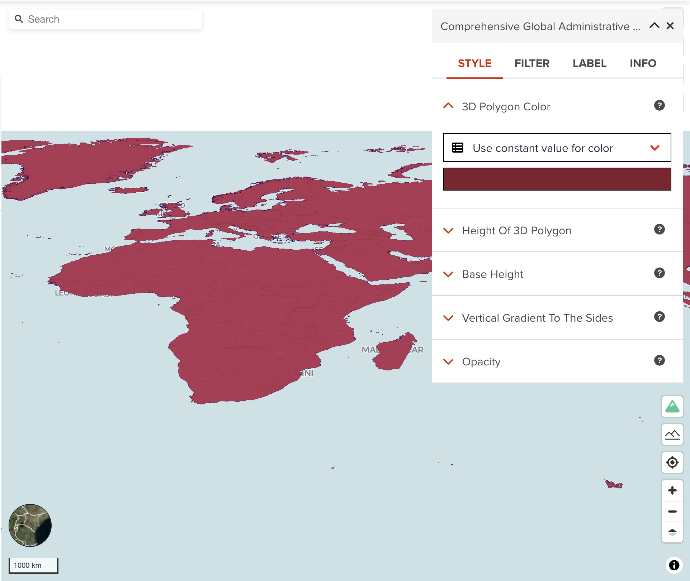
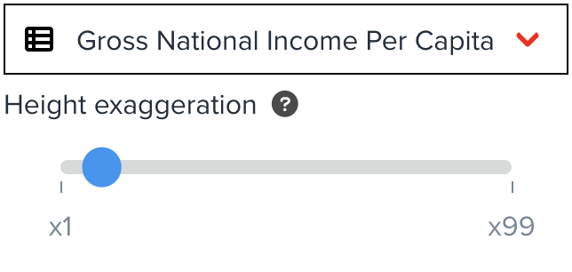

# 3D Polygon visualization

--

You can adjust the following four properties to visualize 3D polygons. This layer type can be suitable if you want to visualize a layer by using three dimensional.

<!-- .element style="height: 400px" -->

---

## 3D Polygon color

You can assign a color or categorized colors for 3D polygon layer. This property can visualize the dataset horizontally (area based). 

The color classification component is the same with color visualization of polygon. <hidden>See [Fill color](./visualize_vector_polygon.md#fill-color) for Polygon layer</hidden>.

---

## Height of 3D Polygon

Visualizing the height of 3D polygons vertically. You can choose either a constant height value or values from selected property. You only can choose a property from numeric fields.

{:style="width: 300px;"}

<!-- .element style="height: 200px" -->

--

By combining two properties of **3D Polygon color** and **Height of 3D polygon**, you can visualize the data by using two indicators. This can be very powerful visualization for analysis.

---

## Base Height

This is an optional property that you maybe need to ajust. It is the height with which to extrude the base of this layer.

---

## Vertical Gradient to the sides

This is an optional property that you maybe can change it. it is whether to apply a vertical gradient to the sides of a 3D polygon layer. If true, sides will be shaded slightly darker farther down.

---

## Next step

In the next section, we are going to learn visualization for line dataset.
