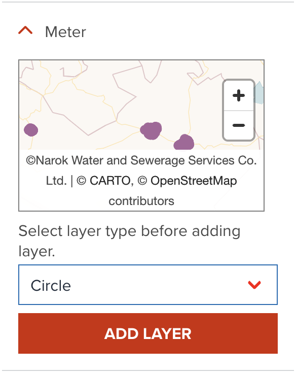

# Circle visualization

Circle is similar to point layer, but it visualize as circles with radius. Unlike point layer, all features on the circle layer are always shown without sampling.

--

As default, GeoHub adds point data as a point layer. If you wish to add circle layer for the point data, you need to select circle layer type before clicking add button as shown in the below.

{:style="width: 300px;"}

<!-- .element style="height: 300px" -->

--

Once, the layer is added, circle will be shown like the following figure.

<!-- .element style="height: 400px" -->

---

## Circle radius

Radius of circle can be set in pixel value. As default, 5px is used.

---

## Circle color

You can assign a color or categorized colors for point layer.

The color classification component is the same with color visualization of polygon. <hidden>See [Fill color](./visualize_vector_polygon.md#fill-color) for Polygon layer</hidden>.

---

## Circle stroke color

Stroke color can also be changed from the default value of black color.

---

## Circle stroke width

Stroke width can be increased if you wish.

<hidden>

!!! note

    As default, circle layer is created with where stroke width is zero. That means stroke color is never shown as default. If you wish to show stroke color, do not forget to change stroke width property together.

</hidden>

---

## Next step

You have explored all vector layer types visualization. In the next step, you will learn how to filter vector data.