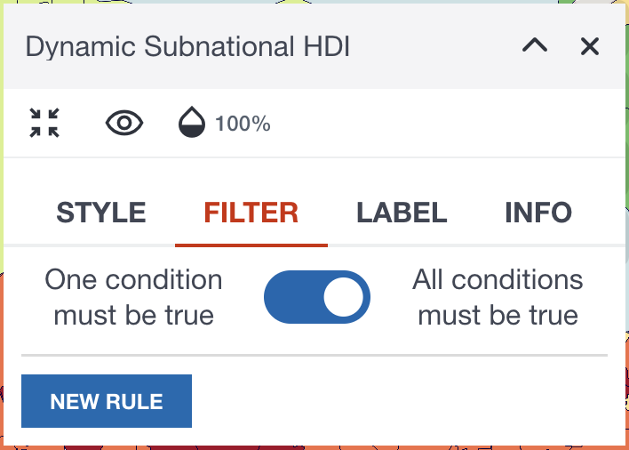
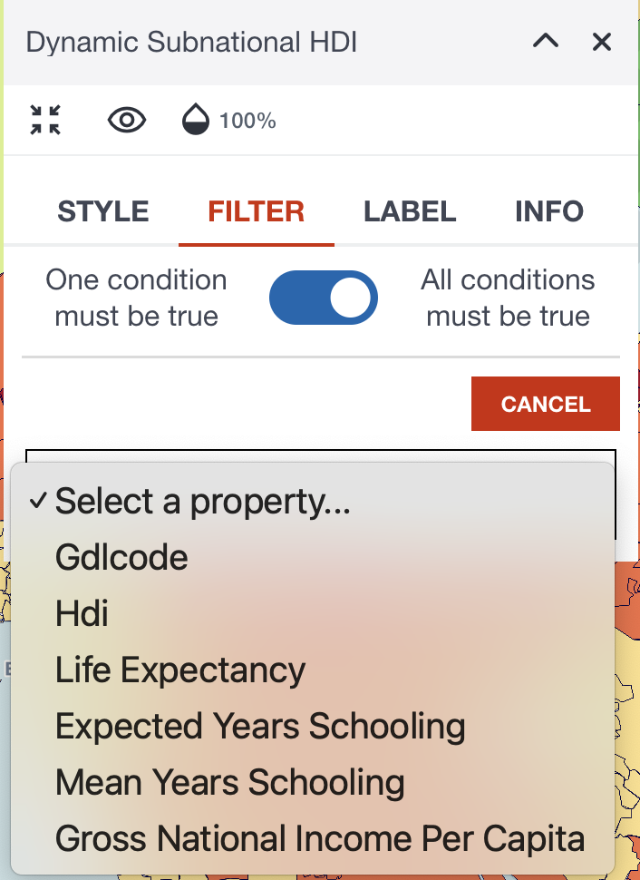
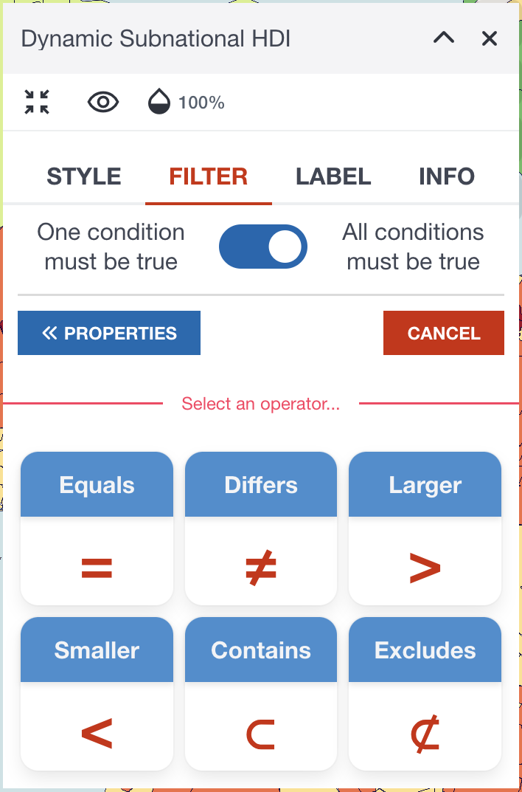
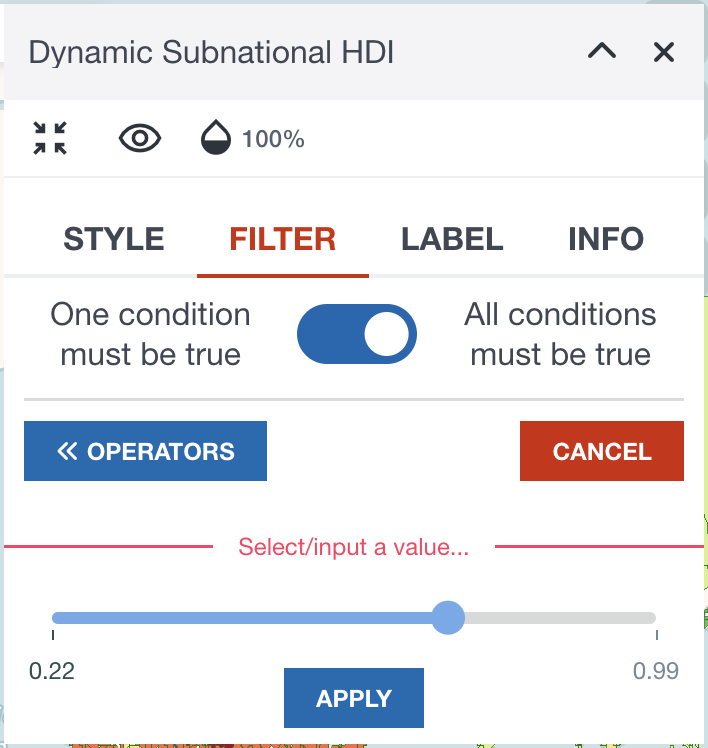
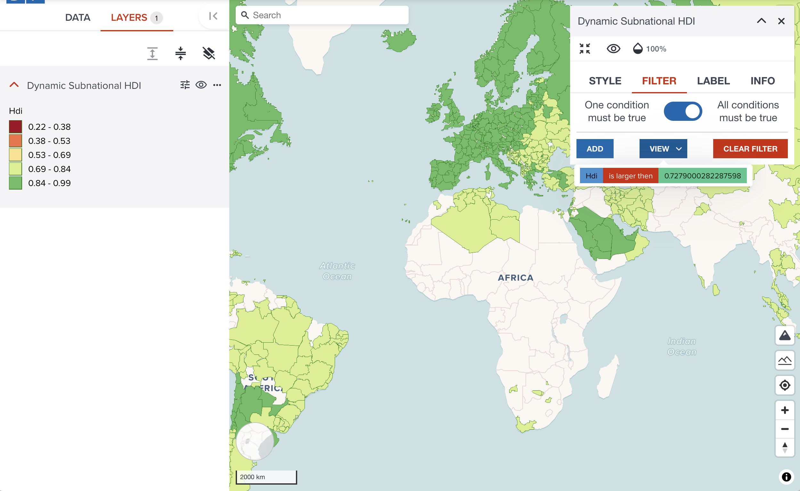
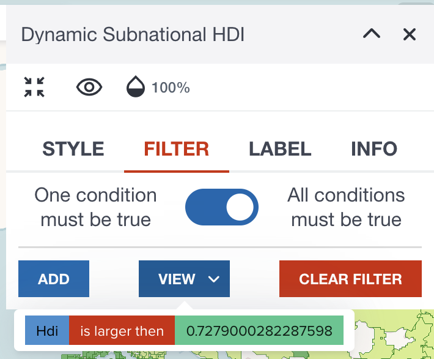

# Filtering vector data

---

## Filter tab

Sometimes you may want to hide some features by using indicators. 

For example, only show where HDI is less than X value. In such case, filtering feature in GeoHub might be useful for you to visualize only focused features.

---

### Add new filter rule

To use filtering, firstly please move to **FILTER** tab, then click **NEW RULE** button.

{:style="width: 300px;"}

<!-- .element style="height: 200px" -->

---

### Select a property

Then, select a property you wish to filter by certain values.

{:style="width: 300px;"}

<!-- .element style="height: 300px" -->

---

### Choose an operator

After selecting a property, you need to choose what operator is used for filtering.

{:style="width: 300px;"}

<!-- .element style="height: 300px" -->

---

### Choose a threshold to filter

After selecting a property and an operator, you need to select a value for filtering. 

The user interface can vary according to the data type of selected property. 

--

The below diagram is an example when you select a numeric field with _Larger_ / _Smaller_ operator. After selecting a value, click **APPLY** button. Your filtering rule will be applied to the map layer immediately.

{:style="width: 300px;"}

<!-- .element style="height: 300px" -->

---

### Result after applying a filter

<!-- .element style="height: 400px" -->

---

### Continue adding or removing filter

You can continue adding another rule if you wish

{:style="width: 300px;"}

<!-- .element style="height: 200px" -->

<hidden>

!!! note

    When you add more than one rules to the layer, the toggle button on the top of **FILTER** tab might be important. As default, `All conditions must be true` (AND filter) is selected. You might need to change to `One condition must be true` (OR filter) to achieve your desired result.

</hidden>

---

## Next step

In the next step, you will learn how to add additional information as labels to vector dataset.