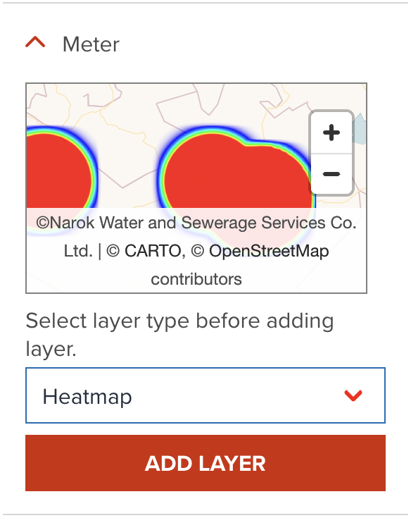
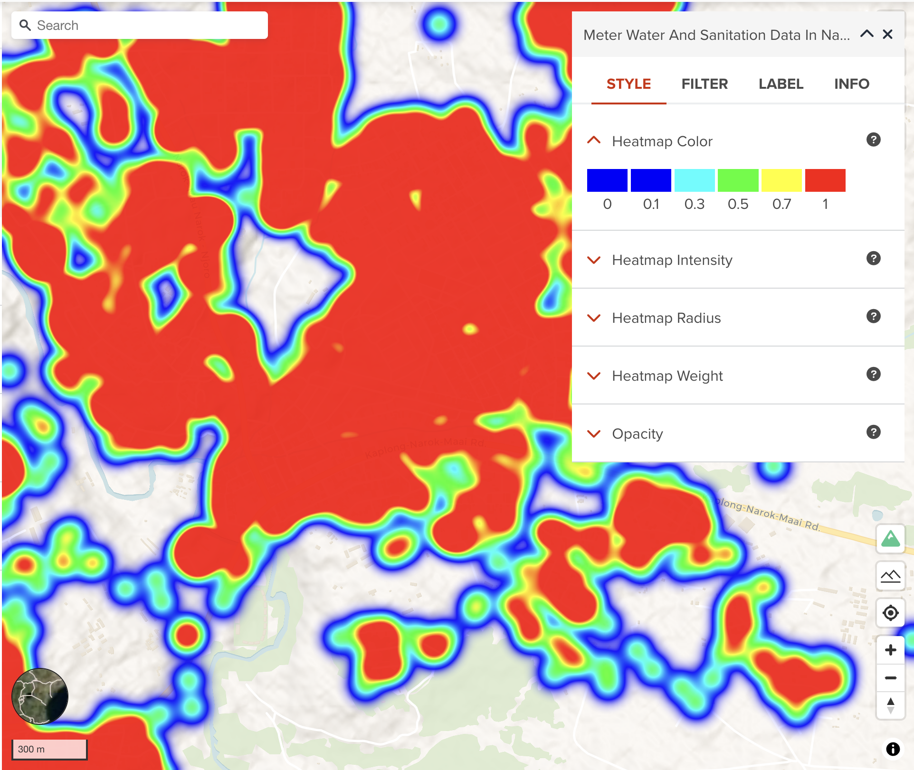

# Heatmap visualization

Heatmap is a quite useful visualization if you want to show the geographic clustering to emphasize how point dataset denses.

--

As default, GeoHub adds point data as a point layer. If you wish to add heatmap layer for the point data, you need to select heatmap layer type before clicking add button as shown in the below.

{:style="width: 300px;"}

<!-- .element style="height: 300px" -->

--

Once, the layer is added, heatmap will be shown like the following figure.

<!-- .element style="height: 400px" -->

---

## Heatmap color

As default, GeoHub creates heatmap with default standard colors shown in the below table. It defines the color of each pixel based on its density value in a heatmap.

--

| Intensity | Color      |
| --------- | ---------- |
| 0         | Blue       |
| 0.1       | Royal Blue |
| 0.3       | Cyan       |
| 0.5       | Lime       |
| 0.7       | Yellow     |
| 1         | Red        |

---

## Heatmap intensity

Heatmap intensity is similar to [heatmap weight](#heatmap-weight) but controls the intensity of the heatmap globally. Primarily used for adjusting the heatmap based on zoom level.

---

## Heatmap radius

It is radius of influence of one heatmap point in pixels. Increasing the value makes the heatmap smoother, but less detailed.

---

## Heatmap weight

Heatmap weight is a measure of how much an individual point contributes to the heatmap. A value of 10 would be equivalent to having 10 points of weight 1 in the same spot. Especially useful when combined with clustering.

---

## Next step

In the next section, we are going to learn a different way - circle layer type of point data visualization.