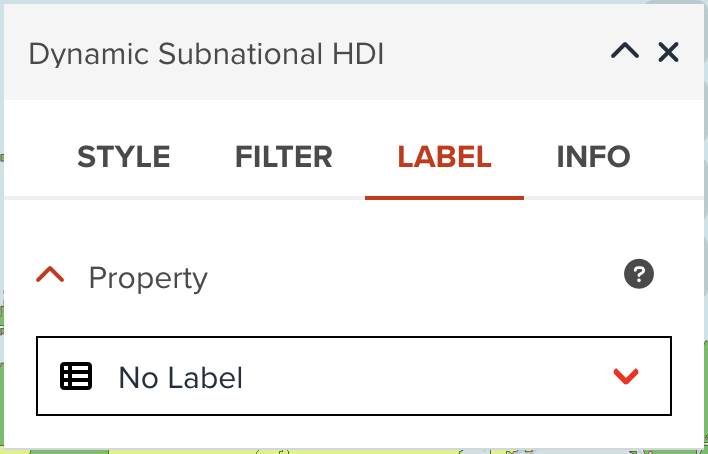
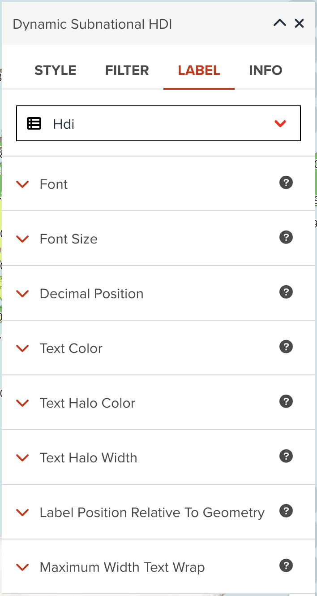

# Labeling for vector data

---

## Label tab

You can also add labels of selected property to the map.

As shown in the below, GeoHub does not create any labels as default. You can change `No Label` to your desired property to be shown as labels.

{:style="width: 300px;"}

<!-- .element style="height: 200px" -->

--

Once you select a property, other label options will appear as shown in the following figure.

{:style="width: 300px;"}

<!-- .element style="height: 500px" -->

---

### Font

There are several fonts (`Proxima Nova`, `Roboto`, `Noto Sans` and `Open Sans`) available in GeoHub. <hidden>As default, `Open Sans Regular` is selected, but you can choose any of fonts and font types (`Regular`, `Bold`, `Italic`, `Bold Italic`, etc) available in dropdown menu.</hidden>

--

### Font size

Font size in pixel can be changed from the default of 12 pixel.

--

### Text color

You can assign a color or categorized colors for labels.

The color classification component is the same with color visualization of polygon. <hidden>See [Fill color](./visualize_vector_polygon.md#fill-color) for Polygon layer</hidden>.

--

### Text halo color

The color of the text's halo, which helps it stand out from backgrounds can be changed. White color is used as default.

--

### Text halo width

Distance of halo to the font outline can be adjusted. Max text halo width is 1/4 of the font-size. 1 pixel is used as default.

--

### Maximum width text wrap

The maximum line width for text wrapping can be adjusted. 10 ems is used as default value.

---

## Next step

In this section, you have learned how to visualize vector layer for each layer type in detail. You are going to explore how you can visualize a raster layer in the next section.