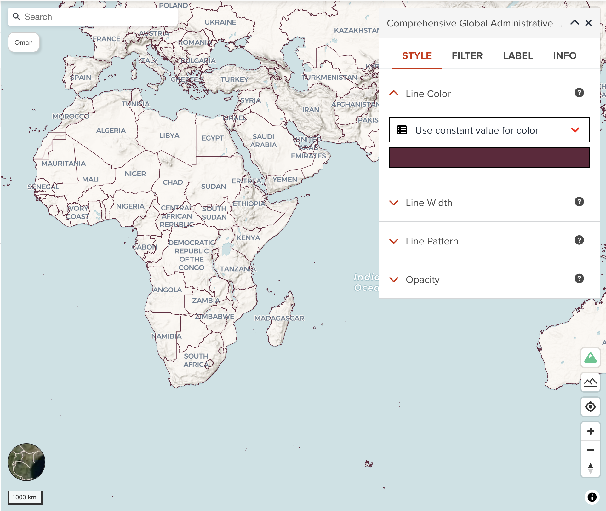
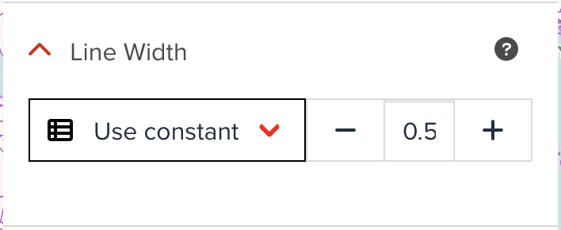
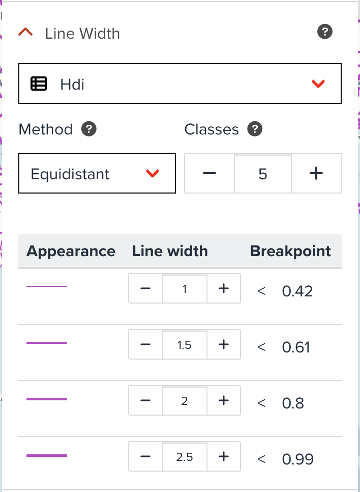
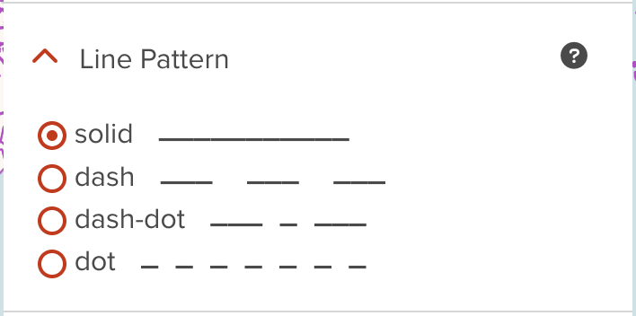

# Line visualization

--

Line layer can be added for a polygon dataset or a line dataset. If you add a line layer for polygon data, only polygon boundaries can be visualized. Unlike fill outline color in polygon layer, line layer has more sophisticated visualization properties like line width and line pattern.

<!-- .element style="height: 400px" -->

---

## Line color

You can assign a color or categorized colors for line layer. 

The color classification component is the same with color visualization of polygon. <hidden>See [Fill color](./visualize_vector_polygon.md#fill-color) for Polygon layer</hidden>.

---

## Line width

Line width can be set by either using a constant width value or using categorized values. The following figure is an example of constant line width. All lines will be shown as the same line width.

{:style="width: 300px;"}

<!-- .element style="height: 200px" -->

--

However, the below figure shows categorized visualization for line width. You can apply different line width values for different value. Just select a property (only numeric fields can be chosen), default categorized table will be generated automatically. You can adjust intervals and width if you wish.

{:style="width: 300px;"}

<!-- .element style="height: 300px" -->

--

Categorized visualization for line can be useful for specific cases. For example, if there is a water pipeline layer on the map. The layer has a propery called `diameter` like 25, 50, 100, 250, etc. If the more larger diameter the pipeline has, the more larger line width is rendered, the line visualization will be more intuitive.

---

## Line pattern

Changing a pattern of line layer is also sometimes useful to visualize several line layers. The below figure shows how **Line Pattern** component looks like. You can select a pattern from _solid_, _dash_, _dash-dot_ or _dot_.

{:style="width: 300px;"}

<!-- .element style="height: 200px" -->

--

For instance, if you have three admin boundaries line layers (admin 0, admin 1 and admin 2). Admin 0 is country layer which can be visualized by solid line, then you can change line pattern for subnational level (admin 1 and admin2) with other line patterns like _dash_ or _dash-dot_.

---

## Next step

In the next section, we are going to learn visualization for point dataset.