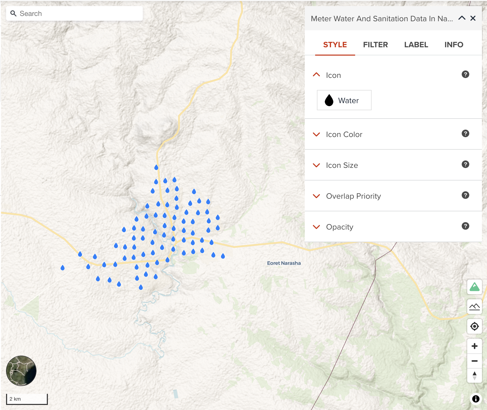
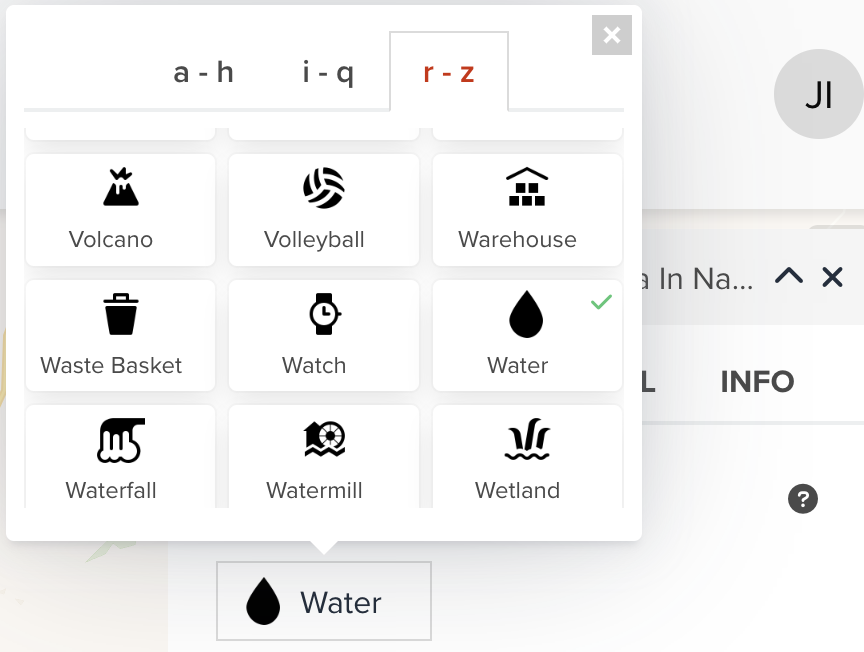

# Point visualization

--
Point data can be visualized as icon or heatmap or circle. As icon visualization, there are several properties you can adjust as shown in the below figure.

<!-- .element style="height: 400px" -->

---

## Icon

GeoHub has a set of map icons from [Mapbox Maki](https://labs.mapbox.com/maki-icons/). The below figure shows our icon selecting interface. You can select an icon in alphabetical order.

{:style="width: 300px;"}

<!-- .element style="height: 300px" -->

---

## Icon color

You can assign a color or categorized colors for icon. 

The color classification component is the same with color visualization of polygon. <hidden>See [Fill color](./visualize_vector_polygon.md#fill-color) for Polygon layer</hidden>.

---

## Icon size

Like [Line Width](./visualize_vector_line.md#line-width) for Line Layer, you can also assign a constant icon size or categorized values for each class to differentiate icon sizes.

---

## Overlap priority

Overlap priority is sometimes important setting for visualization. As default, GeoHub add point layer where `Overlay priority is Never`. This means point data can be sampled in lower zoom level. You will not see all point features unless you zoom in. If you wish all features of this layer to be shown always, `always` can be selected. However, please note your map can be mess in lower zoom level if there are so many features in the layer.

--

`cooperative` is that if the icon collides with another previously drawn symbol, the overlap mode for that symbol is checked. If the previous symbol was placed using never overlap mode, the new icon is hidden. If the previous symbol was placed using always or cooperative overlap mode, the new icon is visible.

---

## Next step

In the next section, we are going to learn heatmap visualization for point dataset.