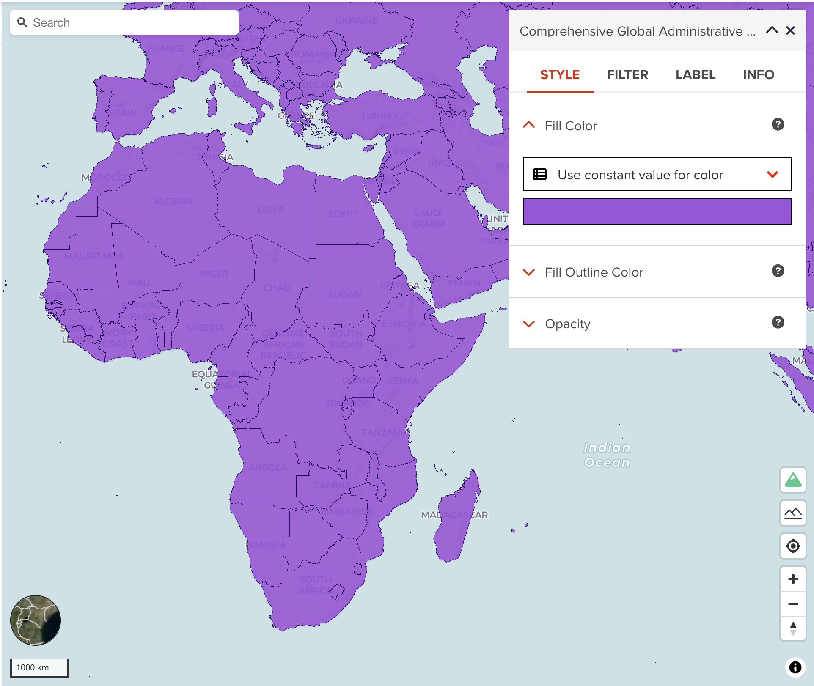
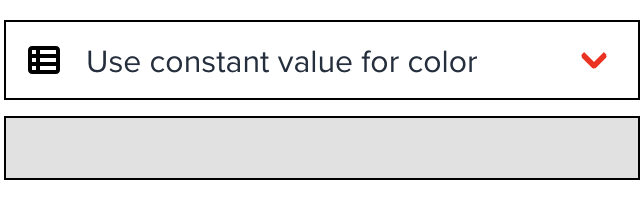
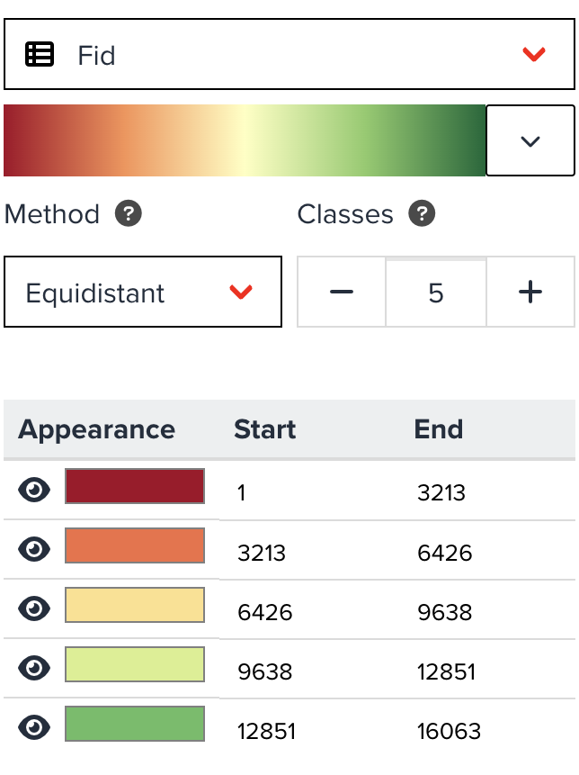
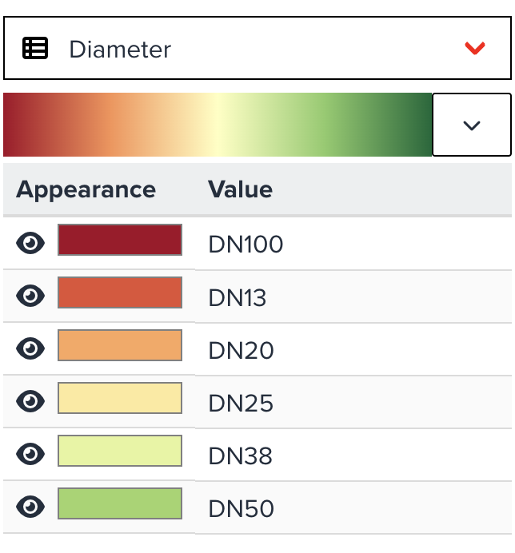

# Polygon visualization

--

<!-- .element style="height: 500px" -->

A polygon layer can style the following two properties.

---

## Fill color

You can choose two ways to set a color to polygons. As default, it uses a constant color which is randomly assigned. This might be useful if you just simply assign a single color to apply for polygon fill color.

{:style="width: 300px;"}

<!-- .element style="height: 200px" -->

---

### Categorized legend (Numeric property)

<hidden>However, you might want to assign different color per value per property.</hidden> In this case, you can also make categories to asign a color for each category class. Select a property from dropdown menu, it will automatically create categorized legend as shown in the below figure.

{:style="width: 300px;"}

<!-- .element style="height: 300px" -->

--

The figure shows an example when you select a numeric column. Numeric column can be classified by setting interval for each class. You can adjust categorized legend by the following parameters:

- **colormap**: You can select a colormap from the button. Colormap is available from three types - _Sequential_, _Diverging_ and _Qualitative_. <hidden>Learn more about colormap [here](./visualize_colormap.md)</hidden>

--

- **Method**: You can choose a classification method from _Equidistant_, _Quantile_, _Logarithmic_ and _Natural Breaks_. <hidden>If the property values are highly skewed, _Logarithmic_ maybe can be selected for better visualization. _Equidistant_ is selected as default. Learn more about classification methods [here](./visualize_classification.md)</hidden>
- **Classes**: As default, a legend will be created for five classes, however you can decrease or increase the number of classes between two and 25 classes.

Furthermore, you can assign different color per class manually by clicking color button in the table.

---

### Unique value legend (String property)

The below figure is also for a categorized legend when a string property is selected. This looks like much simpler than interval legend. You only can change a colormap applied for it. The categorized value table will be automatically created.

{:style="width: 300px;"}

<!-- .element style="height: 250px" -->

---

## Fill outline color

You can assign a color for polygon outline. As default, black color will be assigned.

---

## Next step

In the next section, we are going to learn different type of visualization - 3D polygon for polygon dataset
