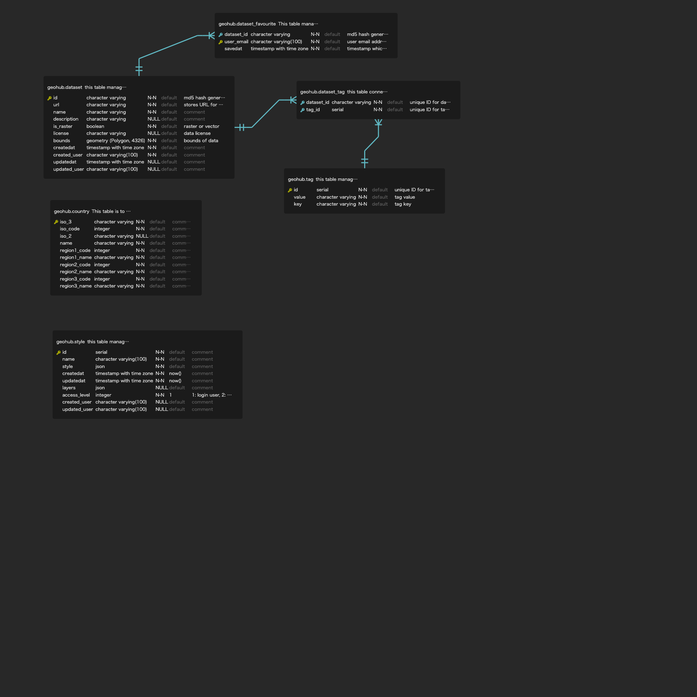

# geohub-cli

This repository is to manage CLI tools for geohub

## Usage

```shell
$geohub -h
Usage: geohub [options] [command]

Options:
  -v, --version     output the version number
  -h, --help        display help for command

Commands:
  azblob [options]      scan azure blob containers to register metadata into PostgreSQL database.
  martin [options]      scan martin layers to register metadata into PostgreSQL database.
  pgtileserv [options]  scan pg_tileserv layers to register metadata into PostgreSQL database.
  stac [options]        scan STAC collections to register metadata into PostgreSQL database.
  delete [options]      Delete items by storage URL
  help [command]        display help for command
```

- Register Azure Blob Containers

```shell
$geohub azblob -h
Usage: geohub azblob [options]

scan azure blob containers to register metadata into PostgreSQL database.

Options:
  -d, --database <dsn>                           PostgreSQL database connection string
  -a, --azaccount <azure_storage_account>        Azure Storage Account
  -k, --azaccountkey <azure_storage_access_key>  Azure Storage Access Key
  -n, --name [container_name...]                 Targeted Azure Blob Container name to scan. It will scan all containers if it is not specified.
  -o, --output [output]                          Output directory for temporary working folder (default: "tmp")
  -t, --titiler-url [titiler-url]                base URL for titiler (default: "https://titiler.undpgeohub.org")
  -h, --help                                     display help for command
```

it takes approximately 23 minutes to finish importing all Azure blob containers (20 NO) of geohub.

- Register martin layers

```shell
$geohub martin -h
Usage: geohub martin [options]

scan martin layers to register metadata into PostgreSQL database.

Options:
  -d, --database <dsn>           PostgreSQL database connection string
  -m, --martin-url [martin-url]  URL for martin index.json (default: "https://martin.undpgeohub.org/index.json")
  -o, --output [output]          Output directory for temporary working folder (default: "tmp")
  -h, --help                     display help for command
```

- Register pg_tilesrev layers

```shell
$geohub pgtileserv -h
Usage: geohub pgtileserv [options]

scan pg_tileserv layers to register metadata into PostgreSQL database.

Options:
  -d, --database <dsn>                   PostgreSQL database connection string
  -p, --pgtileserv-url [pgtileserv-url]  URL for pg_tileserv index.json (default: "https://pgtileserv.undpgeohub.org/index.json")
  -o, --output [output]                  Output directory for temporary working folder (default: "tmp")
  -h, --help                             display help for command
```

- Register STAC collections

```shell
$geohub stac -h
Usage: geohub stac [options]

scan STAC collections to register metadata into PostgreSQL database.

Options:
  -d, --database <dsn>   PostgreSQL database connection string
  -s, --stac <stac>      STAC API root URL. e.g., https://planetarycomputer.microsoft.com/api/stac/v1
  -o, --output [output]  Output directory for temporary working folder (default: "tmp")
  -h, --help             display help for command
```

For example

```shell
# to register STAC by Microsoft Planetary Computer
geohub stac -d <database connection string> -s https://planetarycomputer.microsoft.com/api/stac/v1

# to register STAC by Earth Search
geohub stac -d <database connection string> -s https://earth-search.aws.element84.com/v0/
```

- Delete items by storage URL

```shell
$geohub delete -h
Usage: geohub delete [options]

Delete items by storage URL

Options:
  -d, --database <dsn>  PostgreSQL database connection string
  -u, --url             Storage URL to be deleted
  -o, --output [output]  Output directory for temporary working folder (default: "tmp")
  -h, --help            display help for command
```

## Deploy Azure Function

- Install Azure Developer CLI

https://learn.microsoft.com/en-us/azure/developer/azure-developer-cli/install-azd?tabs=baremetal%2Clinuxmac

- Setup Azure in VSCode

https://learn.microsoft.com/en-us/azure/azure-functions/functions-develop-vs-code?tabs=nodejs

- Click `Deploy to Function App`

## ER diagram

The following ER diagram was generated by [ERD Editor](https://marketplace.visualstudio.com/items?itemName=dineug.vuerd-vscode) extension for VS code.


